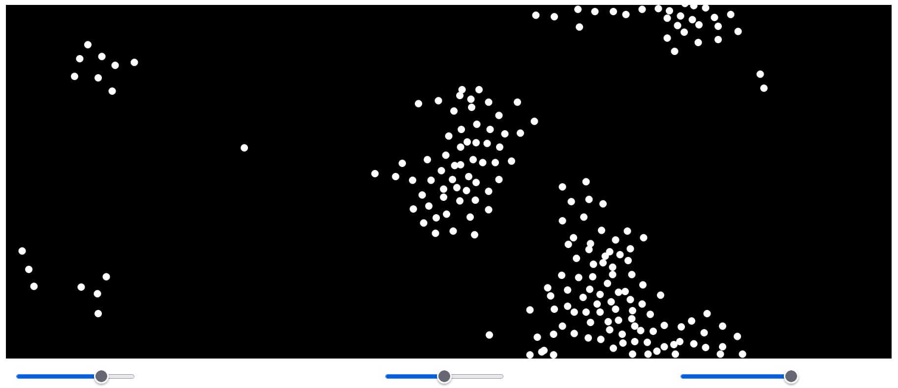

# Boids Simulation

This is a Boids simulation implemented in JavaScript using the p5.Vector library. The simulation models the flocking behavior of birds and demonstrates concepts such as alignment, cohesion, and separation.

## Getting Started

To run the simulation locally, follow these steps:

1. Clone the repository:

``bash
git clone https://github.com/NameerAli/Boids-Simulation.git

2. Open the `index.html` file in a web browser.

3. Interact with the simulation:
- Press the **Start** button to begin the simulation.
- Use the sliders to adjust the parameters such as flock size, alignment factor, cohesion factor, and separation factor.
- Observe the flocking behavior of the boids as they move and interact with each other.

## Dependencies

The simulation relies on the following library:

- [p5.Vector](https://p5js.org/reference/#/p5.Vector): A library that provides a simple and efficient implementation of 2D vectors.

## Usage

The `sketch.js` file contains the main logic of the simulation. It initializes the canvas, creates the flock of boids, and updates their positions and velocities according to the Boids algorithm. The p5.Vector library is used for vector operations such as addition, subtraction, and normalization.

You can customize the simulation by adjusting the parameters in the `sketch.js` file. Experiment with different values for the alignment factor, cohesion factor, and separation factor to observe different flocking behaviors.

## Resources

- [Boids (Flocks, Herds, and Schools): a Distributed Behavioral Model](https://www.red3d.com/cwr/boids/): The original paper by Craig Reynolds introducing the Boids algorithm.

## License

This project is licensed under the [MIT License](LICENSE).

